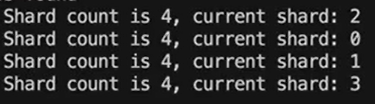

# distrBoltX
Handwriting based on boltDB distributed KV database, the library will be updated from time to time, suitable for small white scholars entry and distributed advanced
<br/>
This project is not integrated as an SDK, nor can it be used as an on-site library. You can understand it as a platform for public learning. In the case of distributed protocol CAP or split-brain, this project does not provide consistency protocol as **raft** for the time being
>该库是基于 **io/etcd.bbolt** 驱动打造一个分布式KV库(Bbolt有点类似innodb 完全兼容ACID事务)，新能完全取决于Bbolt的B+tree的顺序写，和MMAP的预随机读，因为是基于硬盘的读写驱动，所以在固态硬盘上运行的性能最佳
# Prepare the dependency library
> go mod tidy 
# Standalone Start to up
> go mod install; main -db-location=shard0.db  -http-addr=127.0.0.2:8080 -config-file=sharding.toml -shard=shard0
# Supporting a simple data sharding,which the server sharding is being accessed
```toml
[[shards]]
name = "shard0"
idx  = 0
address = "127.0.0.2:8080"
replicas = ["127.0.0.22:8080"]

[[shards]]
name = "shard1"
idx  = 1
address = "127.0.0.3:8081"
replicas = ["127.0.0.33:8080"]

[[shards]]
name = "shard2"
idx  = 2
address = "127.0.0.4:8082"
replicas = ["127.0.0.44:8080"]

[[shards]]
name = "shard3"
idx = 3
address = "127.0.0.5:8083"
replicas = ["127.0.0.55:8080"]

```
# Middleware dependency
>bbolt 
> https://github.com/etcd-io

bbolt is a fork of Ben Johnson's Bolt key/value store. The purpose of this fork is to provide the Go community with an active maintenance and development target for Bolt; the goal is improved reliability and stability. bbolt includes bug fixes, performance enhancements, and features not found in Bolt while preserving backwards compatibility with the Bolt API.

Bolt is a pure Go key/value store inspired by Howard Chu's LMDB project. The goal of the project is to provide a simple, fast, and reliable database for projects that don't require a full database server such as Postgres or MySQL.

Since Bolt is meant to be used as such a low-level piece of functionality, simplicity is key. The API will be small and only focus on getting values and setting values. That's it.

DistrBoltX is secondary developed based on bbolt, adding distributed fragmentation high availability data security and other scenarios

There will be a lot of optimization details in the future, so stay tuned

# Distributed startup
1. ./populate.sh
2.  检查toml配置文件是否对应服务器完整
3. ./luanch.sh

当你看到:<br/>


说明你此时已经启动了四个端口监听四个分片库 ,You know ?

Core module :
1. 数据分片 
2. 读写基准测试
3. 多机备份
4. shard 
5. replicas

集群分片采用CRC64 MOD SHARD_COUNT 得到 当前分片，如果有数据写入当前分片，又单协程轮询同步到副本节点，副本节点启动时即刻加载对主节点的写入监听，内部节点采用节点转发的方式避免集群连接过多(参考redis HASHSLOT REDIRECT)

#### DEBUG
When you need to debug locally, here is a more suitable way that you can start using two VS/IDEA boosters for example<br/>
1. Open both editors
2. Enter two startup scripts in the editor, respectively, as follows
```shell

主节点
 --db-location=shard0.db  --http-addr=127.0.0.2:8080  --grpc-addr=127.0.0.2:50030 --config-file=sharding.toml --config=shard0
副本
--db-location=shard0-r.db --http-addr=127.0.0.22:8080 --grpc-addr=127.0.0.2:50030 --config-file=sharding.toml --config=shard0 --replica

```

#### 部分使用日志
>当你看到如下日志就说明已经成功了同步了
- 主节点日志
```shell
2023/04/12 11:03:15 Shard count is 1 current shard :0 cur config &config.Config{Shards:[]config.Shard{config.Shard{Name:"shard0", Idx:0, Address:"127
.0.0.2:8080"}}}:
execute init for grpc register &web.Server{Db:(*db.Database)(0xc0001a8080), shards:(*config.Shards)(0xc000008810)} register node ip addr : "127.0.0.2
:50030"2023/04/12 11:03:15 server listening at 127.0.0.2:50030
Data sent to the replica is synchronized to the replica node key = "key8",value="value8"The ACK identifier of the replica node synchronization is com
pleted ack = "ack:true"The key asynchronized from the master ,which has been deleted key "key8" val "value8" Data replica sync have been done,deletin
g local key =  "key8"
```
- 副本节点日志
```shell
GOPATH=E:\go-workspace #gosetup
E:\go\bin\go.exe build -o C:\Users\Administrator\AppData\Local\Temp\GoLand\___4go_build_github_com_s5364733_distrBoltX_main.exe github.com/s5364733/distrBoltX/main #gosetup
C:\Users\Administrator\AppData\Local\Temp\GoLand\___4go_build_github_com_s5364733_distrBoltX_main.exe --db-location=shard0-r.db --http-addr=127.0.0.22:8080 --grpc-addr=127.0.0.2:50030 --config-file=sharding.toml --config=shard0 --replica
2023/04/12 11:03:25 Shard count is 1 current shard :0 cur config &config.Config{Shards:[]config.Shard{config.Shard{Name:"shard0", Idx:0, Address:"127
.0.0.2:8080"}}}:
2023/04/12 11:03:35 The key asynchronized from the master , which has been loaded (key:"key8",value:"value8")
```


3. If you only need to start two nodes for testing, you only need to keep one shards shard in sharding.toml as follows:<br/>
```shell
[[shards]]
name = "shard0"
idx  = 0
address = "127.0.0.2:8080"
replicas = ["127.0.0.22:8080"]
```

##### 您可能会问,为什么我在本地可以监听127.0.0.2
因为127.0.0.2是环回地址中的一个是可以使用的,您可以参考 https://superuser.com/questions/393700/what-is-the-127-0-0-2-ip-address-for
#### CHANGELOG_FEATURE
1. 内部连接使用GRPC代替HTTP1.1协议 (done)
2. 取模分片算法采用一致性HASH算发代替用来解决HASH迁移的问题
3. 分片之后数据合并可能会有问题，所有可以参考REDIS HASHTAG 实现HASH聚合 